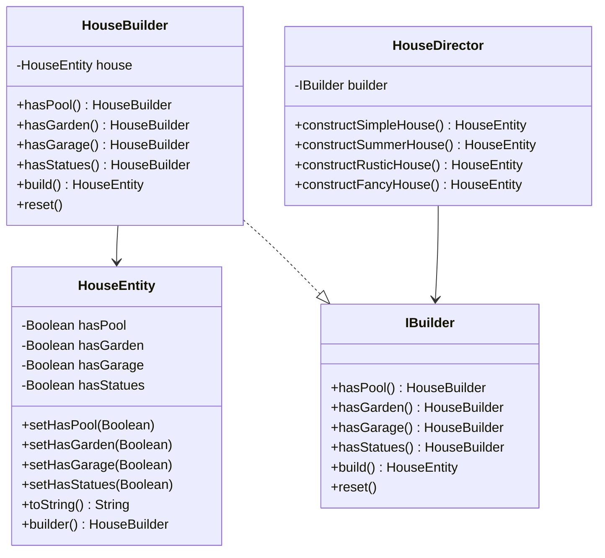

# Builder pattern
 

## Instrucciones:
Partiendo de la entidad "House" deberás implementar el patrón de diseño Builder para permitir que la entidad "House" pueda construir diferentes tipos de casas, según las características mostradas en el diagrama proporcionado. Cada tipo de casa debe representar una combinación específica de atributos (garage, jardín, piscina, estatuas decorativas, etc.).

El objetivo es que el proceso de construcción sea flexible, escalable y desacoplado, siguiendo los principios de diseño orientado a objetos.

 

## Class Diagram

 

## Test Covegare

